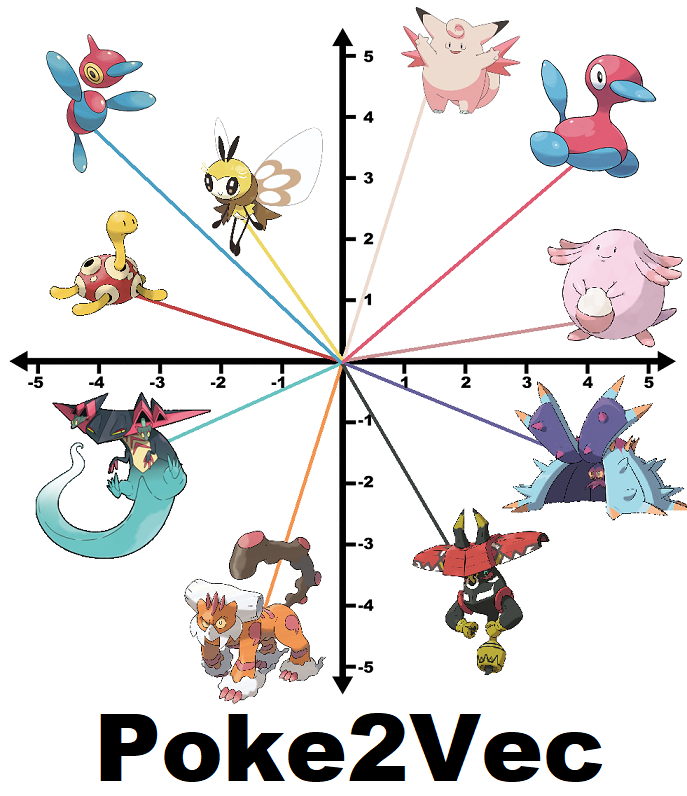

<style type="text/css">
.main-container {
  max-width: 1800px;
  margin-left: auto;
  margin-right: auto;
}
</style>

---
title: 'Poke2Vec: Vector Embeddings of Pokemon'
author: "Ali Turfah"
output: html_document
geometry: margin=2cm
---

```{r setup, include=FALSE}
knitr::opts_chunk$set(echo = TRUE)
```

<center>

</center>

## Introduction / Background

For people unfamiliar with the '2vec' kinds of models, the idea is to go from a one-hot encoded representation (each pokemon corresponds to an 1 in an otherwise entirely 0 vector) to a lower-dimensional one that has some useful information 'baked' into it.

Word2Vec uses the idea that a word is defined by the context it appears in. [Here](https://israelg99.github.io/2017-03-23-Word2Vec-Explained/) is a helpful link that explains Word2Vec in case you're interested. Expanding a bit, this means that words appearing in the same contexts convey similar meaning. Taken this way, it's not super unreasonable to expand this idea to Pokemon, since Pokemon that fill similar 'roles' within a team would probably find themselves having similar teammates. I will be using data from battles hosted on Pokemon Showdown (PS), an online Pokemon battling simulator.


## Model and Data Generation

This part is a bit technical so for people who don't care about the gory details about "how" please skip to the [Results](#Results) section.

#### Model

The model I've described above (a word/pokemon being 'defined' by the words appearing in its context without consideration of position) is referred to as a Continuous Bag-of-Words approach. There are a lot of different ways to fit such a model, the way I've done it is using a two-hidden layer neural network to get two matrices of 'encodings' and 'decodings', and then average the resulting vectors element-wise to get the final embedding. 

## Data Generation - Theory
In an ideal world, I would have access to the actual teams that were used on PS in a given month. In the real world, I do not have access to this data, so I have to estimate it.

The monthly usage statistics files give access to the marginal (eg: $P(Clefable \text{ on team})$) and pairwise conditional (eg: $P(Charizard  \text{ on team | } Clefable \text{ on team})$) probabilities for all pokemon in the metagame. The problem is, the actual probability of a team cannot be inferred from this, so (incorrect) simplifying assumptions had to be made. This next section goes into more technical detail about why this happens/what assumptions end up being made, so unless you really care about statistics [skip ahead](#DGP_P) and take for granted that you can get the probability of a certain team composition.

A joint probability, $P(A, B, C)$, can (repeatedly) be broken down into a marginal and conditional probability as shown below
$$
P(A, B, C) = P(A, B | C) * P(C)
$$
Using pokemon in place of random, you get
$$
P(Spinda, Clefable, Bisharp) = P(Spinda, Clefable | Bisharp) * P(Bisharp)
$$

From the usage statistics, we have the marginal probability for Bisharp. What we are missing is the conditional joint $P(Spinda, Clefable | Bisharp)$, all we have is $P(Spinda | Bisharp)$ and $P(Clefable | Bisharp)$. A potential work-around is to simply use the product of the two conditionals as an approximation of the joint conditional which, from a statistical standpoint, means that I am making an assumption about the conditional independence of two events. Specifically, this assumption means that, given Bisharp is already on a team, the events of Clefable being on the team and Spinda being on the team are independent. Mathematically, this corresponds to the following equations
$$
P(Spinda, Clefable, Bisharp) = P(Spinda, Clefable | Bisharp) * P(Bisharp) \\
P(Spinda, Clefable, Bisharp) ≈ P(Spinda | Bisharp) * P(Clefable | Bisharp) * P(Bisharp)
$$

Where the independence assumption is used to decompose $P(Spinda, Clefable | Bisharp)$ as
$$
P(Spinda, Clefable | Bisharp) = P(Spinda | Clefable, Bisharp) * P(Clefable | Bisharp) \\
P(Spinda, Clefable | Bisharp) = P(Spinda | Bisharp) * P(Clefable | Bisharp)
$$

In my contrived example (and for certain pokemon) this assumption is probably valid (or rather not too badly violated). You might think about high-usage pokemon (Landorus-T, TeleWish Clefable) as the Pokemon being conditioned on where they’re put on teams irrespective of their teammates as examples that do not violate this assumption. As for when this assumption is violated, consider a team deciding between Tapu Bulu or Tangrowth to pair with Toxapex. Certainly, P(Tapu Bulu, Tangrowth | Toxapex) is not equal to P(Tapu Bulu | Toxapex) * P(Tangrowth | Toxapex), as the former is 0 but the latter is not. Basically this set-up does not have visibility to ‘cores’ of more than 2 pokemon, which leads to some funny teams like Gliscor+Lando-T.

For specifics, the position matters so any 6-pokemon team has 6! (720) possible ways it can be arranged. The way I get the probability is, for a team of 6 pokemon (A, B, C, D, E, F) I consider the following conditional/joint breakdowns
$$
P(A, B, C, D, E) = P(B, C, D, E, F | A) * P(A) + P(A, C, D, E, F | B) * P(B) + ...
$$
From this, you break down the conditional joint using the independence assumption, and multiply by 5! (for the possible combinations of the 5-pokemon subteam). This way, all combinations of the 6 pokemon are accounted for in the probability, and hopefully helps deal with the violated assumption as you condition on all pokemon separately.

For a more rigorous look into this process check out [this file](probability_generation_writeup.pdf) from the github repository.

#### Data Generation - Process {#DGP_P}
There are two main steps to actually generate the data, first getting the possible teams and second getting the number of occurrences.

The possible team combinations are generated using Beam Search. At a high level, if I have teams with 4 pokemon on them (for a metagame where there are 6 pokemon per team), then all 4-pokemon teams get expanded to 5 pokemon (considering all combinations), and only the $N$ most likely (where probability of a team is calculated as in the previous section) 5-pokemon combinations are used in the next step. While not perfect, this is much more computationally feasible than considering all possible combinations of 6 pokemon (which is unwieldy when there are more than 50ish pokemon in the metagame). There are problems with this approach, the most egregious of which is that high-usage pokemon have their usage further inflated (I’ve seen results where Clefable has 60% usage based on a metagame where it sees only 40% usage, check the [Results](#Results) section for an example).

Each metagame has a total number of battles, so I sample the teams from the total number of battles (the corresponding statistical distribution is a Multinomial, where each class corresponds to an individual team). There are 2 sampling set-ups available, taking the expected value (eg: $P(Team) * [\text{Total Number of battles}]$) and actually drawing from the distribution (implemented using the stick-breaking approach). This gives a resulting "sample metagame,” with teams and the number of times they occurred.

#### Test Set
A test set is scraped from the top-rated Pokemon Showdown replays for a given tier, with a minimum date threshold. This is to test generalizability of vectors fit to a given month to prediction in later months. As for why I can’t use this to generate the metagame, it only goes back 25 pages which is ~2600 teams at a given moment. I guess you could build a database of teams from the replays by pulling down the most recent ones constantly, but I didn’t think of that until after I wrote the team generation scripts (and these might not be representative of the metagame as a whole).

## Results {#Results}
Alrighty enough of me going on and on about math or whatever, here are some hand-picked results that (a) show what this project is capable of and (b) hopefully get me some ~~grant funding~~ Smogon Technical Project clout.

These results are from a simulation with 250,000 distinct teams based on the Gen7 OU 1695 usage stats for June 2019. The threshold for a pokemon to be considered 'relevant' is that it must get usage greater than 0.5% (this simulated metagame has 125 pokemon in it), capturing most of the pokemon reflected on the final iteration of the USUM Viability rankings. A 1% cutoff can be used and results in a metagame of 89 pokemon, but misses out on such dominating metagame threats as regular Swampert and Muk-Alola.

#### Similarity to the actual 06-2019 OU Metagame
The first thing I want establish is that the simulated metagame is somewhat similar to the actual metagame. Looking at the marginal distributions, the simulated metagame does better than a random vector which is promising. From playing around with the cutoff percentage, the less pokemon in the simulated metagame the better the KL divergence, up to a point.
```
   KL.obs   KL.rand
0.1135541 0.5977038
```
So, in short, the simulated metagame captures the marginal pokemon probabilities better than a completely random guess. You can also look at usage stats from the sampled metagame. The pokemon at the top of the metagame have their values inflated a bit (note the usage statistics are normalized, so they won't be exactly the same as OU's usage numbers).
```
   pokemon          est.prob true.prob
1 Landorus-Therian    0.737     0.504
2 Magearna            0.377     0.295
3 Greninja-Ash        0.258     0.222
4 Ferrothorn          0.263     0.195
5 Tapu Koko           0.217     0.192
6 Kartana             0.204     0.189
7 Tornadus-Therian    0.192     0.163
8 Heatran             0.196     0.158
9 Tapu Lele           0.132     0.134
10 Toxapex             0.250     0.124
```
Holy 74% Landorus-Therian usage. Note that the probabilities used are these numbers (which are the odds a specific team has one of these Pokemon on it) divided by 6, so the actual percents are a lot closer than the results here look; Landorus's difference is on the order of 12% vs 8%, and the rest of them are within 1-2% of the actual results.

#### Prediction Accuracy
The objective for fitting this 2vec model is, given 5 teammates, to predict the 6th (this is often referred to as _What’s his/her last?_). You don’t expect the model to perform incredibly well on this task, but I was pleasantly surprised by the results so I’m showing them here. The data is augmented where each team corresponds to 6 data points, one to predict each member from the remaining 5. The vector embeddings were of size 50. Trained for 15 epochs, the model ends up at ~23% accuracy on the test set of size 5729. I’ve included a “species clause” into the predictions (ie: if Clefable is on the team don’t predict Clefable), which improves the accuracy by a few percentage points.

Something important to note is that I do not filter out cases where the model has to predict an unseen pokemon (one that does not meet the threshold to be included in the sample metagame); if it is part of the 5-pokemon used for prediction I just ignore it and if it is the thing to be guessed the model just gets it wrong. Removing the latter cases (of which there were 340) of predicting an unseen pokemon puts the model at 24% accuracy.
```
Test Set Total: 5735
Test Set Usage:
Landorus-Therian              UNK       Ferrothorn         Magearna
             482              340              254              230
         Heatran         Greninja Tornadus-Therian       Rotom-Wash
             220              216              189              166
Test Set Predicted Usage:
Landorus-Therian         Magearna          Toxapex          Chansey
            2303              942              433              255
    Greninja-Ash       Ferrothorn          Heatran        Excadrill
             197              167              148              138


# Uknown:  340
% Unknown: 5.93
Unknown most commonly predicted as:
Landorus-Therian     Lopunny-Mega         Magearna          Toxapex
      0.36764706       0.15294118       0.11764706       0.07352941
         Chansey        Excadrill       Ferrothorn         Quagsire
      0.06470588       0.04705882       0.02647059       0.02352941


# Correct: 1305
% Correct: 22.76
% Correct (No Unknowns): 24.19
```

#### Analysis of the Embeddings
If you remember at the start of this I said that pokemon appearing in similar “contexts” should have similar vectors. Below are some pokemon I chose and the pokemon 10 pokemon whose vectors are closest by the [cosine similarity](https://en.wikipedia.org/wiki/Cosine_similarity) metric (which effectively is a measure of the angle between the vectors).
```
Pokemon Landorus-Therian
Furthest: Kartana 0.766 | Tapu-Lele 0.756 | Tapu-Koko 0.743 | Heatran 0.722 | Greninja-Ash 0.692 | Magearna 0.678 | Rotom-Wash 0.665 | Magnezone 0.662

Pokemon Clefable
Furthest: Ditto 0.88 | Gliscor 0.856 | Toxapex 0.847 | Reuniclus 0.84 | Chansey 0.826 | Hippowdon 0.733 | Celesteela 0.733 | Tangrowth 0.728

Pokemon Tapu-Bulu
Furthest: Gastrodon 0.771 | Venusaur-Mega 0.725 | Keldeo 0.719 | Tangrowth 0.706 | Garchomp 0.618 | Scizor-Mega 0.604 | Tornadus-Therian 0.595 | Zapdos 0.593

Pokemon Ferrothorn
Furthest: Greninja-Ash 0.76 | Tornadus-Therian 0.682 | Heatran 0.679 | Tapu-Koko 0.673 | Azumarill 0.66 | Landorus-Therian 0.658 | Tapu-Fini 0.655 | Gengar 0.63
```
I do not claim to have in-depth metagame knowledge of USUM OU at all, so I’ll only be able to make high-level observation. Clefable is interesting because Reuniclus (another slow/bulky Magic Guard user) shows up, but generally it shows up with stall pokemon. Tapu Bulu has pokemon forming good cores with it with high similarity, plus Tangrowth/Venusaur-Mega who fill the role of bulky Grass-type. Ferrothorn is in a similar boat (Ash-Greninja, Heatran, and Landorus-T forming hazard stacking cores), plus it’s kind of funny how you can make a half-decent team from the top 6 teammates.

```
Pokemon Hawlucha
Furthest: Porygon-Z 0.743 | Kommo-o 0.702 | Manectric-Mega 0.691 | Diancie-Mega 0.681 | Blacephalon 0.673 | Tapu-Koko 0.669 | Rotom-Wash 0.651 | Crawdaunt 0.621

Pokemon Ribombee
Furthest: Dragonite 0.908 | Azelf 0.86 | Charizard-Mega-X 0.844 | Gyarados 0.834 | Charizard-Mega-Y 0.801 | Serperior 0.792 | Breloom 0.779 | Mimikyu 0.777

Pokemon Swampert-Mega
Furthest: Pelipper 0.925 | Azumarill 0.916 | Manaphy 0.89 | Kingdra 0.867 | Volcanion 0.857 | Araquanid 0.794 | Klefki 0.677 | Diggersby 0.667

Pokemon Sableye-Mega
Furthest: Quagsire 0.922 | Skarmory 0.91 | Pyukumuku 0.897 | Amoonguss 0.866 | Chansey 0.863 | Bisharp 0.789 | Gliscor 0.781 | Zeraora 0.769

Pokemon Chansey
Furthest: Skarmory 0.919 | Gliscor 0.911 | Ditto 0.91 | Amoonguss 0.875 | Sableye-Mega 0.863 | Pyukumuku 0.837 | Clefable 0.826 | Quagsire 0.821
```
These next pokemon are found on very specific archetypes, and their teammates are thus reflected. Hawlucha and Robomobee have HO teammates (and Tapu Koko for terrain support in the former’s case). Swampert’s most similar pokemon are all (except for Diggersby) rain teammates. Sableye-Mega and Chansey both feature stall teammates (though I’m unsure why Zeraora shows up).

```
Pokemon Weavile
Furthest: Zeraora 0.838 | Bisharp 0.807 | Mamoswine 0.777 | Jirachi 0.774 | Salamence 0.698 | Muk-Alola 0.671 | Shuckle 0.642 | Amoonguss 0.585

Pokemon Bisharp
Furthest: Zeraora 0.851 | Weavile 0.807 | Quagsire 0.805 | Sableye-Mega 0.789 | Pyukumuku 0.785 | Skarmory 0.746 | Amoonguss 0.74 | Muk-Alola 0.693

Pokemon Excadrill
Furthest: Tyranitar 0.87 | Breloom 0.811 | Tyranitar-Mega 0.793 | Mimikyu 0.772 | Ribombee 0.749 | Gyarados 0.747 | Dragonite 0.746 | Azelf 0.735

Pokemon Seismitoad
Furthest: Gastrodon 0.853 | Diggersby 0.777 | Garchomp-Mega 0.756 | Nidoking 0.65 | Swampert-Mega 0.65 | Azumarill 0.627 | Pelipper 0.614 | Tornadus-Therian 0.579
```
This is the last batch I’m going to analyze, which highlights something somewhat subtle. Looking at Weavile and Bisharp, you see quickly that there are two different types of teammates showing up: Stall and more offensive ones. This could be an artifact of the way teams are generated, but if not it means that different parts of the pokemon vectors are able to encode different aspects of a pokemon’s teammates (ex: Weavile & Bisharp both provide pursuit support, which stall teams appreciate). Excadrill is in a similar boat, where I think one set of the nearest teammates are Sand Teams and the others like Sash Lead Excadrill (or at the very least appreciate Rapid Spin Excadrill). Seismitoad is in the same boat, except this time it's Mono-Ground and Rain teams (plus the people who use it like Gastrodon).

#### Overall Metagame Scatterplot
If you’ve looked at word vectors I’m sure you’ve seen those scatterplots where fruits and european country capitals form their own clusters, so here is the analogous visualization that you can make from the pokemon vector embeddings. Note that, as with any dimension reduction, information will be lost so don’t take this visualization as the end-all be-all. That being said, outside of the mass cluster at the center you do see some well-defined groupings based on playstyle. Please forgive the size it's a bit hard to get the text to not be an overlapped mess but still be readable.

<center>
{width=85%}
</center>

Around (-2, -1) you see, with few exceptions, a cluster of stall pokemon like Skarmory, Chansey, and Sableye-Mega. Looking to (-1, 3) you pretty much have different flavors of HO pokemon. Kind of funny but far to the right (4, 0) you have some of the Trick Room setters/abusers. If you plot different Principal Components, you see different clusters (I think 3 and 4 gives a very strong Trick Room cluster). The actual xy-positions are meaningless but similar pokemon clustering together was the ultimate point of this, so between this and the earlier analysis of cosine distance I hope I’ve convinced you that the goal has (at least somewhat) been achieved.

## Duplicating These Results
The link to the github is included at the end. There isn't much there besides the code but I'll fix that eventually. For anyone wanting to run this on their own, the most time-consuming tasks are generating the teams and pulling down the test set. My computer takes 15-16 minutes to simulate the metagame of 250,000 distinct teams from 125 pokemon (the config.py file has times for different metagame sizes/number of teams if you’re interested). Results are similar with less teams, if you run into memory problems (the 125x250K consumes ~23GB of RAM). Calls to get replay logs are always slow, but generating the test set is not too bad/only needs to be done once.

Fitting the embeddings should take less than 5 minutes if you’re on a GPU ; it is a relatively small one with only 2 matrices that need to be estimated. If you run into time problems on a CPU, you can tweak the metagame size to get a smaller training set, increase the batch size, or reduce the number of epochs. If you opt for reducing epochs consider reducing the dimensionality of the embeddings as well.

## Conclusion
That's all I've got so far folks. Hopefully you found it as interesting as it was for me to code up. I can come up with the results for other metagames if people are interested in seeing them as well, for people who don't want to go through the trouble of setting up the environment. That being said, thanks for reading and hope you have an awesome day!

Link to Github Repo: <https://github.com/aturfah/poke2vec>

<br/>
<br/>
<br/>
